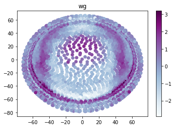
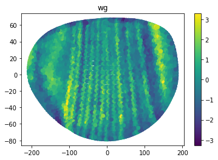

# Parameters explanation of PERLER (Y. Okochi, 02/09/21)

This tutorial is application of perler to D. melanogaster (Dmel) dataset (Karaiskos et al., 2017).

### import perler


```python
import perler
```

    /Users/yasokochi/OneDrive - Kyoto University/backup/07_perler_private_test/.venv/lib/python3.8/site-packages/pandas/compat/__init__.py:97: UserWarning: Could not import the lzma module. Your installed Python is incomplete. Attempting to use lzma compression will result in a RuntimeError.
      warnings.warn(msg)


### Import the additional modules

These modules are not necessary for the procedures of perler. However, they are necessary for loading and saving data.


```python
#for loading data
import pandas as pd

#for saving data
import pickle
import gzip

%matplotlib inline
```

### Loading dataset

This dataset is generated by Karaiskos et al., 2017

and is aquired from Drosophila Virtual Expression eXplorer (DVEX, URL: https://shiny.mdc-berlin.de/DVEX/)


・dge_normalized.txt: scRNAseq data

・bdtnp.txt: in situ data

・geometry_dvex.txt: cell location data


ref: Karaiskos et al, 2017 (doi: 10.1126/science.aan3235)


```python
RNAseq = pd.read_csv('data/dge_normalized.txt',sep='\t').T
BDTNP = pd.read_csv('data/bdtnp.txt', sep='\t')
location=pd.read_csv("data/geometry_dvex.txt", delimiter=" ") #optional
```

### Making PERLER object

##### The essencial parameters of this function are...

・data; scRNAseq data with gene columns and sample rows

・reference; in situ hybridization data with gene columns and sample rows

・n_metagenes (int) ; it depends on how many metagenes you want to extract. default is 60.

Additionally, you can choose

・DR (str) ; How to reduce dimentionality of the dataset. 'PLSC' (default), 'PCA', and 'NA' (no DR) can be used.

・print_iter (bool) ; If print_iter is True, likelihood is printed in each 5 steps of EM algorithm implemented in plr.em_algorithm().


```python
%%time
plr = perler.PERLER(data = RNAseq, reference=BDTNP, print_iter=True)
```

    CPU times: user 2.73 s, sys: 1.08 s, total: 3.8 s
    Wall time: 313 ms


##### you can see the parameters of this object

Dimensinality reduction


```python
plr.DR
```


    'PLSC'


scRNAseq data


```python
plr.data.head()
```


<div>
<style scoped>
    .dataframe tbody tr th:only-of-type {
        vertical-align: middle;
    }

    .dataframe tbody tr th {
        vertical-align: top;
    }

    .dataframe thead th {
        text-align: right;
    }
</style>
<table border="1" class="dataframe">
  <thead>
    <tr style="text-align: right;">
      <th></th>
      <th>128up</th>
      <th>140up</th>
      <th>14-3-3epsilon</th>
      <th>14-3-3zeta</th>
      <th>18w</th>
      <th>26-29-p</th>
      <th>2mit</th>
      <th>4EHP</th>
      <th>4E-T</th>
      <th>5-HT1A</th>
      <th>...</th>
      <th>ZnT77C</th>
      <th>ZnT86D</th>
      <th>zpg</th>
      <th>Zpr1</th>
      <th>zuc</th>
      <th>Zw10</th>
      <th>Zwilch</th>
      <th>zyd</th>
      <th>zye</th>
      <th>Zyx</th>
    </tr>
  </thead>
  <tbody>
    <tr>
      <th>GTACTAATTACN_2</th>
      <td>2.5699</td>
      <td>1.1599</td>
      <td>8.8384</td>
      <td>5.9422</td>
      <td>3.4430</td>
      <td>0.0</td>
      <td>0.0</td>
      <td>4.6831</td>
      <td>1.7945</td>
      <td>0.0</td>
      <td>...</td>
      <td>0.0</td>
      <td>0.0000</td>
      <td>2.2337</td>
      <td>2.8424</td>
      <td>3.5981</td>
      <td>2.8424</td>
      <td>0.0000</td>
      <td>1.1599</td>
      <td>0.0</td>
      <td>3.4430</td>
    </tr>
    <tr>
      <th>AGGCTAATGGAC_3</th>
      <td>2.5087</td>
      <td>3.0066</td>
      <td>8.7878</td>
      <td>5.4336</td>
      <td>3.0066</td>
      <td>0.0</td>
      <td>0.0</td>
      <td>3.9139</td>
      <td>2.5087</td>
      <td>0.0</td>
      <td>...</td>
      <td>0.0</td>
      <td>1.7423</td>
      <td>0.0000</td>
      <td>2.5087</td>
      <td>3.0066</td>
      <td>3.0066</td>
      <td>1.7423</td>
      <td>1.7423</td>
      <td>0.0</td>
      <td>4.3048</td>
    </tr>
    <tr>
      <th>TAGACAAAAGCT_4</th>
      <td>0.0000</td>
      <td>0.0000</td>
      <td>8.8431</td>
      <td>6.0169</td>
      <td>2.3175</td>
      <td>0.0</td>
      <td>0.0</td>
      <td>3.1650</td>
      <td>2.3175</td>
      <td>0.0</td>
      <td>...</td>
      <td>0.0</td>
      <td>0.0000</td>
      <td>4.0823</td>
      <td>0.0000</td>
      <td>2.3175</td>
      <td>2.3175</td>
      <td>2.3175</td>
      <td>0.0000</td>
      <td>0.0</td>
      <td>4.0823</td>
    </tr>
    <tr>
      <th>TCTACTAGTGTN_5</th>
      <td>0.0000</td>
      <td>0.0000</td>
      <td>8.8687</td>
      <td>5.0161</td>
      <td>4.0600</td>
      <td>0.0</td>
      <td>0.0</td>
      <td>4.0600</td>
      <td>3.6735</td>
      <td>0.0</td>
      <td>...</td>
      <td>0.0</td>
      <td>2.2986</td>
      <td>0.0000</td>
      <td>0.0000</td>
      <td>3.1440</td>
      <td>2.2986</td>
      <td>3.1440</td>
      <td>2.2986</td>
      <td>0.0</td>
      <td>5.1810</td>
    </tr>
    <tr>
      <th>CCGTGCTGAACA_3</th>
      <td>0.0000</td>
      <td>0.0000</td>
      <td>8.3452</td>
      <td>6.0097</td>
      <td>3.5326</td>
      <td>0.0</td>
      <td>0.0</td>
      <td>4.2188</td>
      <td>2.1776</td>
      <td>0.0</td>
      <td>...</td>
      <td>0.0</td>
      <td>2.1776</td>
      <td>2.1776</td>
      <td>3.5326</td>
      <td>3.5326</td>
      <td>0.0000</td>
      <td>0.0000</td>
      <td>3.0086</td>
      <td>0.0</td>
      <td>3.9161</td>
    </tr>
  </tbody>
</table>
<p>5 rows × 8924 columns</p>
</div>


Reference data


```python
plr.ref.head()
```


<div>
<style scoped>
    .dataframe tbody tr th:only-of-type {
        vertical-align: middle;
    }

    .dataframe tbody tr th {
        vertical-align: top;
    }

    .dataframe thead th {
        text-align: right;
    }
</style>
<table border="1" class="dataframe">
  <thead>
    <tr style="text-align: right;">
      <th></th>
      <th>aay</th>
      <th>Ama</th>
      <th>Ance</th>
      <th>Antp</th>
      <th>apt</th>
      <th>Blimp-1</th>
      <th>bmm</th>
      <th>bowl</th>
      <th>brk</th>
      <th>Btk29A</th>
      <th>...</th>
      <th>tkv</th>
      <th>tll</th>
      <th>toc</th>
      <th>Traf4</th>
      <th>trn</th>
      <th>tsh</th>
      <th>twi</th>
      <th>zen</th>
      <th>zen2</th>
      <th>zfh1</th>
    </tr>
  </thead>
  <tbody>
    <tr>
      <th>0</th>
      <td>0.116516</td>
      <td>0.224190</td>
      <td>0.033730</td>
      <td>0.104307</td>
      <td>0.673878</td>
      <td>0.856570</td>
      <td>0.469676</td>
      <td>0.286151</td>
      <td>0.320923</td>
      <td>0.737946</td>
      <td>...</td>
      <td>0.353227</td>
      <td>0.102896</td>
      <td>0.153453</td>
      <td>0.129360</td>
      <td>0.087361</td>
      <td>0.147089</td>
      <td>0.225082</td>
      <td>0.027564</td>
      <td>0.297847</td>
      <td>0.372422</td>
    </tr>
    <tr>
      <th>1</th>
      <td>0.113320</td>
      <td>0.208761</td>
      <td>0.044785</td>
      <td>0.103447</td>
      <td>0.743820</td>
      <td>0.462554</td>
      <td>0.570401</td>
      <td>0.345240</td>
      <td>0.320727</td>
      <td>0.913163</td>
      <td>...</td>
      <td>0.268072</td>
      <td>0.093506</td>
      <td>0.206405</td>
      <td>0.313327</td>
      <td>0.230506</td>
      <td>0.190749</td>
      <td>0.440296</td>
      <td>0.024157</td>
      <td>0.455723</td>
      <td>0.389489</td>
    </tr>
    <tr>
      <th>2</th>
      <td>0.092872</td>
      <td>0.172598</td>
      <td>0.036166</td>
      <td>0.096985</td>
      <td>0.838291</td>
      <td>0.467538</td>
      <td>0.478229</td>
      <td>0.377768</td>
      <td>0.297598</td>
      <td>0.931254</td>
      <td>...</td>
      <td>0.315466</td>
      <td>0.090488</td>
      <td>0.196441</td>
      <td>0.161869</td>
      <td>0.102645</td>
      <td>0.177968</td>
      <td>0.347098</td>
      <td>0.019817</td>
      <td>0.598716</td>
      <td>0.502384</td>
    </tr>
    <tr>
      <th>3</th>
      <td>0.101251</td>
      <td>0.207963</td>
      <td>0.066009</td>
      <td>0.092872</td>
      <td>0.597823</td>
      <td>0.497481</td>
      <td>0.479122</td>
      <td>0.580058</td>
      <td>0.334111</td>
      <td>0.746340</td>
      <td>...</td>
      <td>0.211007</td>
      <td>0.110080</td>
      <td>0.205833</td>
      <td>0.287976</td>
      <td>0.382287</td>
      <td>0.189138</td>
      <td>0.542763</td>
      <td>0.019013</td>
      <td>0.570066</td>
      <td>0.397117</td>
    </tr>
    <tr>
      <th>4</th>
      <td>0.127009</td>
      <td>0.176440</td>
      <td>0.084271</td>
      <td>0.027938</td>
      <td>0.621983</td>
      <td>0.833522</td>
      <td>0.680243</td>
      <td>0.201147</td>
      <td>0.359235</td>
      <td>0.755608</td>
      <td>...</td>
      <td>0.447295</td>
      <td>0.079012</td>
      <td>0.152232</td>
      <td>0.105062</td>
      <td>0.109857</td>
      <td>0.166762</td>
      <td>0.259750</td>
      <td>0.025874</td>
      <td>0.349462</td>
      <td>0.498263</td>
    </tr>
  </tbody>
</table>
<p>5 rows × 84 columns</p>
</div>


### Generative linear mapping (the first step of perler)

#### The parameter fitting by EM algorithm

##### The essencial parameters of this function are...

・optimize_pi (bool) ; If True, mixing coefficients (pi) are optimized by EM algorithm. If False, mixing coefficients are fixed inital values. The default is True.


```python
%%time
plr.em_algorithm(optimize_pi = False)
```

    0 -inf
    5 -299624.18626059196
    10 -299590.62390697666
    15 -299589.8590121893
    CPU times: user 10min 37s, sys: 6min 28s, total: 17min 5s
    Wall time: 1min 13s


#### Calculate the pair-wise distance between scRNAseq data and reference data


```python
%%time
plr.calc_dist()
```

    CPU times: user 10 s, sys: 582 ms, total: 10.6 s
    Wall time: 9.15 s


showing pair-wise distance between scRNAseq data ans ISH data


```python
plr.DM
```


    array([[11.66246569, 12.08091157, 12.26846815, ..., 10.36298864,
            13.82620994, 12.66811752],
           [11.64935174, 12.72820877, 12.02254983, ...,  9.84309914,
            14.74666774, 12.89949192],
           [11.39303771, 12.55478903, 12.15278166, ..., 10.0576136 ,
            14.35595434, 12.87620518],
           ...,
           [13.48630743, 12.31511249, 12.43747386, ..., 10.34489002,
            15.36380292, 11.91720586],
           [12.06000309, 12.37032896, 12.24725776, ...,  8.9933911 ,
            14.98793979, 11.59333187],
           [12.39086062, 12.69985529, 12.64896961, ...,  9.8647652 ,
            15.12243099, 11.60282628]])


### Hyperparameter estimation

#### conducting LOOCV experiment

##### The essencial parameters of this function are...

・workers (int) ; numbers of workers in multiprocessing using joblib. The default is -1 (using the max numbers of workers in your computer)


```python
%%time
plr.loocv()
```

    [Parallel(n_jobs=-1)]: Using backend LokyBackend with 16 concurrent workers.
    [Parallel(n_jobs=-1)]: Done   9 tasks      | elapsed:  3.9min
    [Parallel(n_jobs=-1)]: Done  18 tasks      | elapsed:  7.3min
    [Parallel(n_jobs=-1)]: Done  29 tasks      | elapsed:  7.5min
    [Parallel(n_jobs=-1)]: Done  40 tasks      | elapsed: 11.1min
    [Parallel(n_jobs=-1)]: Done  53 tasks      | elapsed: 14.5min
    [Parallel(n_jobs=-1)]: Done  62 out of  84 | elapsed: 14.8min remaining:  5.2min
    [Parallel(n_jobs=-1)]: Done  71 out of  84 | elapsed: 18.1min remaining:  3.3min
    [Parallel(n_jobs=-1)]: Done  80 out of  84 | elapsed: 18.3min remaining:   55.0s


    CPU times: user 5.56 s, sys: 9.84 s, total: 15.4 s
    Wall time: 18min 55s


    [Parallel(n_jobs=-1)]: Done  84 out of  84 | elapsed: 18.9min finished


#### fitting the hyperparameters by grid search

##### The essencial parameters of this function are...

・workers (int) ; numbers of workers in multiprocessing of scipy.optimize.brute function. The default is -1 (using the max numbers of workers in your computer)

Additionally, you can choose

・grids (tupple) ; set the ranges parameters of scipy.optimize.brute function. The default is ((0,1), (0,1)).


```python
%%time
plr.grid_search()
```

    /Users/yasokochi/OneDrive - Kyoto University/backup/07_perler_private_test/.venv/lib/python3.8/site-packages/numpy/lib/function_base.py:2642: RuntimeWarning: invalid value encountered in true_divide
      c /= stddev[:, None]
    /Users/yasokochi/OneDrive - Kyoto University/backup/07_perler_private_test/.venv/lib/python3.8/site-packages/numpy/lib/function_base.py:2643: RuntimeWarning: invalid value encountered in true_divide
      c /= stddev[None, :]


    CPU times: user 1h 5min 39s, sys: 17min 5s, total: 1h 22min 44s
    Wall time: 40min 29s


showing the estimated hyperparameters


```python
plr.res
```


    array([0.1399398, 0.5778626])


### Spatial reconstruction (the second step of perler)

##### The essencial parameters of this function are...

・location (pandas.DataFrame object, optional) ; If you have cell location data of ISH data, you can add location data to the result of perler through this parameter. This pandas.DataFrame object must have columns which specify x_axis and y_axis (and z_axis for 3_dimensional data) of the coordinates of the cells. The default is None.


##### For Dmel dataset...

・mirror (bool, only requierd in the Dmel dataset (Karaiskos., et al, 2017)) ; In Dmel dataset, the result of perler must be mirrored for visualization. Please see Methods in our manuscripts and Karaiskos, et al., 2017. The default is False.

・_3d (bool, only requierd in the Dmel dataset (Karaiskos., et al, 2017)) ; In Dmel dataset, the columns of cell location dataframe is changed from ['x_coord'...] to ['X'...] in our implementation for the clarity of the code. The default is False.


```python
%%time
plr.spatial_reconstruction(location = location, mirror = True, _3d = True)
```

    CPU times: user 4.32 s, sys: 729 ms, total: 5.05 s
    Wall time: 1.89 s


#### showing the reconstructed result


```python
plr.result_with_location.head()
```


<div>
<style scoped>
    .dataframe tbody tr th:only-of-type {
        vertical-align: middle;
    }

    .dataframe tbody tr th {
        vertical-align: top;
    }

    .dataframe thead th {
        text-align: right;
    }
</style>
<table border="1" class="dataframe">
  <thead>
    <tr style="text-align: right;">
      <th></th>
      <th>X</th>
      <th>Y</th>
      <th>Z</th>
      <th>128up</th>
      <th>140up</th>
      <th>14-3-3epsilon</th>
      <th>14-3-3zeta</th>
      <th>18w</th>
      <th>26-29-p</th>
      <th>2mit</th>
      <th>...</th>
      <th>ZnT77C</th>
      <th>ZnT86D</th>
      <th>zpg</th>
      <th>Zpr1</th>
      <th>zuc</th>
      <th>Zw10</th>
      <th>Zwilch</th>
      <th>zyd</th>
      <th>zye</th>
      <th>Zyx</th>
    </tr>
  </thead>
  <tbody>
    <tr>
      <th>0</th>
      <td>-194.04</td>
      <td>0.22</td>
      <td>30.20</td>
      <td>-0.739069</td>
      <td>-1.393472</td>
      <td>-0.260589</td>
      <td>1.872177</td>
      <td>0.630912</td>
      <td>-0.101289</td>
      <td>-1.049733</td>
      <td>...</td>
      <td>-1.951010</td>
      <td>-0.301837</td>
      <td>-1.501124</td>
      <td>-1.210678</td>
      <td>0.308605</td>
      <td>0.846586</td>
      <td>-1.923636</td>
      <td>-0.195292</td>
      <td>0.440880</td>
      <td>0.131902</td>
    </tr>
    <tr>
      <th>1</th>
      <td>-203.32</td>
      <td>1.93</td>
      <td>20.08</td>
      <td>0.473367</td>
      <td>0.134813</td>
      <td>-0.547033</td>
      <td>3.166362</td>
      <td>-1.113052</td>
      <td>-1.581986</td>
      <td>-0.233430</td>
      <td>...</td>
      <td>-1.485814</td>
      <td>-1.433723</td>
      <td>-1.963887</td>
      <td>-1.130922</td>
      <td>0.691803</td>
      <td>0.084599</td>
      <td>-0.837563</td>
      <td>-0.967996</td>
      <td>-0.023366</td>
      <td>-0.054861</td>
    </tr>
    <tr>
      <th>2</th>
      <td>-200.25</td>
      <td>3.59</td>
      <td>23.93</td>
      <td>-0.091385</td>
      <td>-0.868999</td>
      <td>-1.097820</td>
      <td>2.800128</td>
      <td>-0.314447</td>
      <td>-1.204530</td>
      <td>-0.874382</td>
      <td>...</td>
      <td>-0.926128</td>
      <td>-0.953141</td>
      <td>-2.029136</td>
      <td>-1.126496</td>
      <td>0.564448</td>
      <td>-0.002860</td>
      <td>-1.476474</td>
      <td>-0.560861</td>
      <td>0.181601</td>
      <td>-0.622756</td>
    </tr>
    <tr>
      <th>3</th>
      <td>-205.88</td>
      <td>3.58</td>
      <td>14.82</td>
      <td>2.039144</td>
      <td>0.249724</td>
      <td>-1.268568</td>
      <td>1.440638</td>
      <td>-1.474992</td>
      <td>-1.293342</td>
      <td>-1.220573</td>
      <td>...</td>
      <td>-0.203949</td>
      <td>-1.296218</td>
      <td>-2.165345</td>
      <td>-1.639595</td>
      <td>-0.903268</td>
      <td>-0.616723</td>
      <td>-1.471205</td>
      <td>-0.881958</td>
      <td>-0.644366</td>
      <td>-0.508275</td>
    </tr>
    <tr>
      <th>4</th>
      <td>-193.17</td>
      <td>9.53</td>
      <td>29.67</td>
      <td>-1.040152</td>
      <td>-0.374649</td>
      <td>0.051052</td>
      <td>2.688287</td>
      <td>0.470806</td>
      <td>-0.408677</td>
      <td>-0.195628</td>
      <td>...</td>
      <td>-1.361757</td>
      <td>-1.216846</td>
      <td>-1.294949</td>
      <td>-1.122171</td>
      <td>0.265767</td>
      <td>0.332753</td>
      <td>-1.315198</td>
      <td>-0.546326</td>
      <td>2.074378</td>
      <td>-0.925120</td>
    </tr>
  </tbody>
</table>
<p>5 rows × 8927 columns</p>
</div>


### Visualization (for the Dmel dataset (Karaiskos., et al, 2017 ))

For visualization of Dmel dataset, we implemented a function, Dmel_visualization()

This function enables you to visualize a Dmel virtual embryo of the specific gene from the specific view

##### The essencial parameters of this function are...

・gene (str) ; gene name you want to visualize


・view (str) ; set the view of the Dmel virtual embryo. This parameter must be among "lateral", "anterior", "posterior", "top", and "bottom". The default is "lateral".


・color_map (str) ; color map of plt.scatter() function. The default is "BuPu".


```python
plr.Dmel_visualization(gene = 'wg')
```

    /Users/yasokochi/OneDrive - Kyoto University/backup/07_perler_private_test/.venv/lib/python3.8/site-packages/perler/perler_class.py:698: UserWarning: Matplotlib is currently using module://ipykernel.pylab.backend_inline, which is a non-GUI backend, so cannot show the figure.
      fig.show()


    

    


```python
plr.Dmel_visualization(gene = 'wg', view = 'anterior')
```

    /Users/yasokochi/OneDrive - Kyoto University/backup/07_perler_private_test/.venv/lib/python3.8/site-packages/perler/perler_class.py:716: UserWarning: Matplotlib is currently using module://ipykernel.pylab.backend_inline, which is a non-GUI backend, so cannot show the figure.
      fig.show()


    

    


```python
plr.Dmel_visualization(gene = 'wg', color_map = 'viridis')
```

    /Users/yasokochi/OneDrive - Kyoto University/backup/07_perler_private_test/.venv/lib/python3.8/site-packages/perler/perler_class.py:698: UserWarning: Matplotlib is currently using module://ipykernel.pylab.backend_inline, which is a non-GUI backend, so cannot show the figure.
      fig.show()


    

    


```python

```
