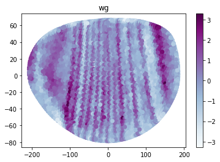

# A blief tutorial of PERLER (Y. Okochi, 02/09/21)

This tutorial is application of perler to D. melanogaster (Dmel) dataset (Karaiskos et al., 2017).

### environment


```python
!sw_vers
```

    ProductName:	Mac OS X
    ProductVersion:	10.15.7
    BuildVersion:	19H2


```python
import sys
sys.version
```


    '3.8.3 (default, Jul 14 2020, 15:24:14) \n[Clang 11.0.3 (clang-1103.0.32.62)]'


### import perler


```python
import perler

#for loading data
import pandas as pd
%matplotlib inline
```

    /Users/yasokochi/OneDrive - Kyoto University/backup/07_perler_private_test/.venv/lib/python3.8/site-packages/pandas/compat/__init__.py:97: UserWarning: Could not import the lzma module. Your installed Python is incomplete. Attempting to use lzma compression will result in a RuntimeError.
      warnings.warn(msg)


```python
perler.__version__
```


    '0.1.0'


### Loading dataset

This dataset is generated by Karaiskos et al., 2017

and is aquired from Drosophila Virtual Expression eXplorer (DVEX, URL: https://shiny.mdc-berlin.de/DVEX/)


・dge_normalized.txt: scRNAseq data

・bdtnp.txt: in situ data

・geometry_dvex.txt: cell location data


ref: Karaiskos et al, 2017 (doi: 10.1126/science.aan3235)


```python
RNAseq = pd.read_csv('data/dge_normalized.txt',sep='\t').T
BDTNP = pd.read_csv('data/bdtnp.txt', sep='\t')
location=pd.read_csv("data/geometry_dvex.txt", delimiter=" ") #optional
```

### PERLER procedures

##### Making PERLER object


```python
%%time
plr = perler.PERLER(data = RNAseq, reference=BDTNP, print_iter=True)
```

    CPU times: user 2.95 s, sys: 867 ms, total: 3.81 s
    Wall time: 306 ms


##### Generative linear mapping (the first step of perler)


```python
%%time
#The parameter fitting by EM algorithm
plr.em_algorithm(optimize_pi = False)
#Calculate the pair-wise distance between scRNAseq data and reference data
plr.calc_dist()
```

    0 -inf
    5 -299624.18626059196
    10 -299590.62390697666
    15 -299589.8590121893
    CPU times: user 10min 10s, sys: 6min, total: 16min 10s
    Wall time: 1min 17s


##### Hyperparameter estimation


```python
%%time
#conducting LOOCV experiment
plr.loocv()
#fitting the hyperparameters by grid search
plr.grid_search()
```

    [Parallel(n_jobs=-1)]: Using backend LokyBackend with 16 concurrent workers.
    [Parallel(n_jobs=-1)]: Done   9 tasks      | elapsed:  3.9min
    [Parallel(n_jobs=-1)]: Done  18 tasks      | elapsed:  7.4min
    [Parallel(n_jobs=-1)]: Done  29 tasks      | elapsed:  7.6min
    [Parallel(n_jobs=-1)]: Done  40 tasks      | elapsed: 11.3min
    [Parallel(n_jobs=-1)]: Done  53 tasks      | elapsed: 14.8min
    [Parallel(n_jobs=-1)]: Done  62 out of  84 | elapsed: 15.0min remaining:  5.3min
    [Parallel(n_jobs=-1)]: Done  71 out of  84 | elapsed: 18.4min remaining:  3.4min
    [Parallel(n_jobs=-1)]: Done  80 out of  84 | elapsed: 18.7min remaining:   56.0s
    [Parallel(n_jobs=-1)]: Done  84 out of  84 | elapsed: 19.3min finished
    /Users/yasokochi/OneDrive - Kyoto University/backup/07_perler_private_test/.venv/lib/python3.8/site-packages/numpy/lib/function_base.py:2642: RuntimeWarning: invalid value encountered in true_divide
      c /= stddev[:, None]
    /Users/yasokochi/OneDrive - Kyoto University/backup/07_perler_private_test/.venv/lib/python3.8/site-packages/numpy/lib/function_base.py:2643: RuntimeWarning: invalid value encountered in true_divide
      c /= stddev[None, :]


    CPU times: user 1h 2min 18s, sys: 14min 53s, total: 1h 17min 11s
    Wall time: 57min 39s


##### Spatial reconstruction (the second step of perler)


```python
%%time
plr.spatial_reconstruction(location = location, mirror = True, _3d = True)
```

    CPU times: user 4.31 s, sys: 667 ms, total: 4.98 s
    Wall time: 1.79 s


#### showing the reconstructed result


```python
plr.result_with_location.head()
```


<div>
<style scoped>
    .dataframe tbody tr th:only-of-type {
        vertical-align: middle;
    }

    .dataframe tbody tr th {
        vertical-align: top;
    }

    .dataframe thead th {
        text-align: right;
    }
</style>
<table border="1" class="dataframe">
  <thead>
    <tr style="text-align: right;">
      <th></th>
      <th>X</th>
      <th>Y</th>
      <th>Z</th>
      <th>128up</th>
      <th>140up</th>
      <th>14-3-3epsilon</th>
      <th>14-3-3zeta</th>
      <th>18w</th>
      <th>26-29-p</th>
      <th>2mit</th>
      <th>...</th>
      <th>ZnT77C</th>
      <th>ZnT86D</th>
      <th>zpg</th>
      <th>Zpr1</th>
      <th>zuc</th>
      <th>Zw10</th>
      <th>Zwilch</th>
      <th>zyd</th>
      <th>zye</th>
      <th>Zyx</th>
    </tr>
  </thead>
  <tbody>
    <tr>
      <th>0</th>
      <td>-194.04</td>
      <td>0.22</td>
      <td>30.20</td>
      <td>-0.739069</td>
      <td>-1.393472</td>
      <td>-0.260589</td>
      <td>1.872177</td>
      <td>0.630912</td>
      <td>-0.101289</td>
      <td>-1.049733</td>
      <td>...</td>
      <td>-1.951010</td>
      <td>-0.301837</td>
      <td>-1.501124</td>
      <td>-1.210678</td>
      <td>0.308605</td>
      <td>0.846586</td>
      <td>-1.923636</td>
      <td>-0.195292</td>
      <td>0.440880</td>
      <td>0.131902</td>
    </tr>
    <tr>
      <th>1</th>
      <td>-203.32</td>
      <td>1.93</td>
      <td>20.08</td>
      <td>0.473367</td>
      <td>0.134813</td>
      <td>-0.547033</td>
      <td>3.166362</td>
      <td>-1.113052</td>
      <td>-1.581986</td>
      <td>-0.233430</td>
      <td>...</td>
      <td>-1.485814</td>
      <td>-1.433723</td>
      <td>-1.963887</td>
      <td>-1.130922</td>
      <td>0.691803</td>
      <td>0.084599</td>
      <td>-0.837563</td>
      <td>-0.967996</td>
      <td>-0.023366</td>
      <td>-0.054861</td>
    </tr>
    <tr>
      <th>2</th>
      <td>-200.25</td>
      <td>3.59</td>
      <td>23.93</td>
      <td>-0.091385</td>
      <td>-0.868999</td>
      <td>-1.097820</td>
      <td>2.800128</td>
      <td>-0.314447</td>
      <td>-1.204530</td>
      <td>-0.874382</td>
      <td>...</td>
      <td>-0.926128</td>
      <td>-0.953141</td>
      <td>-2.029136</td>
      <td>-1.126496</td>
      <td>0.564448</td>
      <td>-0.002860</td>
      <td>-1.476474</td>
      <td>-0.560861</td>
      <td>0.181601</td>
      <td>-0.622756</td>
    </tr>
    <tr>
      <th>3</th>
      <td>-205.88</td>
      <td>3.58</td>
      <td>14.82</td>
      <td>2.039144</td>
      <td>0.249724</td>
      <td>-1.268568</td>
      <td>1.440638</td>
      <td>-1.474992</td>
      <td>-1.293342</td>
      <td>-1.220573</td>
      <td>...</td>
      <td>-0.203949</td>
      <td>-1.296218</td>
      <td>-2.165345</td>
      <td>-1.639595</td>
      <td>-0.903268</td>
      <td>-0.616723</td>
      <td>-1.471205</td>
      <td>-0.881958</td>
      <td>-0.644366</td>
      <td>-0.508275</td>
    </tr>
    <tr>
      <th>4</th>
      <td>-193.17</td>
      <td>9.53</td>
      <td>29.67</td>
      <td>-1.040152</td>
      <td>-0.374649</td>
      <td>0.051052</td>
      <td>2.688287</td>
      <td>0.470806</td>
      <td>-0.408677</td>
      <td>-0.195628</td>
      <td>...</td>
      <td>-1.361757</td>
      <td>-1.216846</td>
      <td>-1.294949</td>
      <td>-1.122171</td>
      <td>0.265767</td>
      <td>0.332753</td>
      <td>-1.315198</td>
      <td>-0.546326</td>
      <td>2.074378</td>
      <td>-0.925120</td>
    </tr>
  </tbody>
</table>
<p>5 rows × 8927 columns</p>
</div>


### Visualization (for the Dmel dataset (Karaiskos., et al, 2017 ))


```python
plr.Dmel_visualization(gene = 'wg')
```

    /Users/yasokochi/OneDrive - Kyoto University/backup/07_perler_private_test/.venv/lib/python3.8/site-packages/perler/perler_class.py:698: UserWarning: Matplotlib is currently using module://ipykernel.pylab.backend_inline, which is a non-GUI backend, so cannot show the figure.
      fig.show()


    

    

